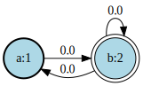
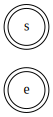
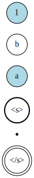
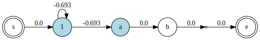

# Finite State Machines

The MarkovModels package represents Markov chains as probabilistic
Finite State Machine (FSMs). Here is an example of FSM as used by the
package:



The double edge circle node with the label "<s>" (respectively "</s>")
is the initial (respectively final) state of the FSM. States with light
blue background color are *emitting states*, that is, they are
associated with a probability density function index (`pdfindex`). If
they have no label, this index is use when displaying the node - as in
the example above. White circle node with a label written inside are
*non-emitting labeled states*. The states represented as point are
neither emitting nor have a label. Finally, the number on the links
are the log-probabilities to move from one state to another.

!!! note
    To be able to visualize FSMs as in the example above when using
    [IJulia](https://github.com/JuliaLang/IJulia.jl), make sure that
    the `dot` program (from [graphviz](https://graphviz.org/)) is
    available in your shell `PATH` variable. Also, you won't be able
    to visualize the FSM in the REPL.

In the following, we present the tools provided by the MarkovModels
package manipulate such FSM. All the examples below assume that you
have already imported the MarkovModels package by doing `using
MarkovModels`.

## Creating FSMs

The first step is to create an FSM object.
```julia
fsm = FSM()
```


When created, the FSM has only two states: the initial state and the
final state. In the MarkovModels, FSMs cannot have multiple initial
for final states.

You can add states to the FSM by using the function `addstate!`:
```julia
s1 = addstate!(fsm, pdfindex = 1)
s2 = addstate!(fsm, pdfindex = 2, label = "a")
s3 = addstate!(fsm, label = "b")
s4 = addstate!(fsm)
```


Note that a state can be:
  * emitting and labeled
  * emitting only
  * labeled only
  * non-emitting and non-labeled (nil state)
The initial and final states are specific nil states.

The `link!` allows to add weighted arcs between states:
```julia
link!(fsm, initstate(fsm), s1)
link!(fsm, s1, s1, log(1/2))
link!(fsm, s1, s2, log(1/2))
link!(fsm, s2, s3)
link!(fsm, s3, s4)
link!(fsm, s4, finalstate(fsm))
```


Finally, we provide a special constructor for convenience:
```@docs
LinearFSM(::AbstractArray{<:Label}, ::Dict{<:Label, <:Pdfindex})
```

## FSM operations

```@meta
CurrentModule = MarkovModels
```

```@docs
addselfloop!(::FSM, ::Real)
compose!(::FSM, ::Dict{Label, FSM})
concat(::FSM, ::FSM)
minimize!(::FSM)
removenilstates!(::FSM)
Base.union(::FSM, ::FSM)
weightnormalize!(::FSM)
```

