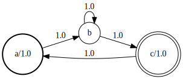

# Finite State Machines

The MarkovModels package represents Markov chains as probabilistic a
Finite State Machine (FSM).  Here is an example of FSM as used by the
package:



The thick line node indicates the starting state whereas the double
line node indicates the ending states.

!!! note
    To be able to visualize FSMs as in the example above when using
    [IJulia](https://github.com/JuliaLang/IJulia.jl), make sure that
    the `dot` program (from [graphviz](https://graphviz.org/)) is
    available in your shell `PATH` variable. Also, you won't be able
    to visualize the FSM in the REPL.

In the following, we present the tools provided by the package
manipulate such FSM. All the examples below assume that you
have already imported the MarkovModels.jl package by doing `using
MarkovModels`.

## Creating FSMs

FSMs are represented by the following structure:
```@docs
FSM
```
Our FSMs operate in the log-semifield where each number can be
interpreted as a log-probability. The package provide the following
type:
```julia
T = Float64
SF = LogSemifield{T}
```

Then, too create an FSM object simply type:
```julia
fsm = FSM{SF}()
```
When created, the FSM has only two states: the initial state and the
final state. FSMs cannot have multiple initial for final states.

You can add states to the FSM by using the function `addstate!`:
```julia
s1 = addstate!(fsm, pdfindex = 1)
s2 = addstate!(fsm, pdfindex = 2, label = "a")
s3 = addstate!(fsm, label = "b")
s4 = addstate!(fsm)
```


Note that a state can be:
  * emitting and labeled
  * emitting only
  * labeled only
  * non-emitting and non-labeled (nil state)

You also need to define which state is a *starting state* and which
one is an *ending state* (there can be several starting/ending states):
```julia
setinit!(s1)
setfinal!(s4)
```


The `link!` function add weighted arcs between states:
```julia
link!(fsm, s1, s1, SF(log(1/2)))
link!(fsm, s1, s2, SF(log(1/2)))
link!(fsm, s2, s3)
link!(fsm, s3, s4)
```


## FSM operations

```@docs
compile
determinize
minimize
renormalize!
remove_eps
replace(::FSM{T}, ::Dict) where T
transpose
```
